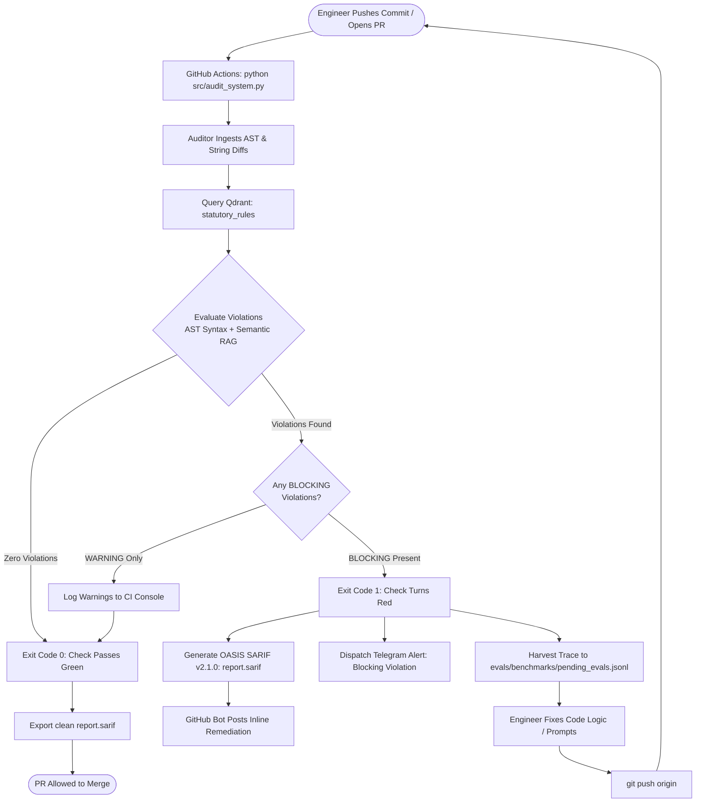

# Pull Request Compliance Decision Tree & Governance Lifecycle

This document specifies the operational decision pathways executed by the `AISafetyCompliance` gatekeeper during automated CI/CD pipeline runs. It details deterministic gating criteria, exemption waiver protocols, remediation formats, and trace harvesting.

---

## 1. High-Level CI/CD Enforcement Flowchart

When an engineer opens or pushes to a Pull Request targeting `main`, GitHub Actions executes `src/audit_system.py`.



---

## 2. Evaluation Decision Matrix

The Auditor assesses extracted code tokens and prompt strings against two legal regimes. Violations are categorized by severity level:

| Classification | Statutory Authority | Trigger Conditions | CI Outcome |
| :--- | :--- | :--- | :--- |
| **BLOCKING** | **UK DUAA 2025 s. 80**<br>(Article 22C UK GDPR) | Automated decision-making logic without human escalation routes, or explicitly declaring `human_escalation_available: False`. | **Exit Code 1** (Blocks merge unless override waiver is provided). |
| **BLOCKING** | **EU AI Act Reg 2024/1689**<br>(Article 50 Transparency) | System prompt instructions that direct the model to impersonate a human worker or conceal synthetic identity. | **Exit Code 1** (Blocks merge unless override waiver is provided). |
| **WARNING** | **EU AI Act Reg 2024/1689**<br>(Article 14 Human Oversight) | High-risk classification features (e.g. CV scoring, credit evaluation) operating with soft confidence thresholds. | **Exit Code 0** (Logs warning and suggested telemetry). |

---

## 3. Waiver & Exemption Protocols

Certain pull requests—such as adversarial red-teaming test suites or internal unit test fixtures—require intentionally violating patterns to test system robustness. 

### 3.1 Applying an Authorized Waiver
Engineers must pass an explicit `--override-reason` parameter via CI configuration or PR label:

```bash
python src/audit_system.py examples/pr_violation_deceptive_prompt.py \
  --override-reason "Internal red-teaming harness: verified by Trust & Safety (Ticket SEC-4102)"
```

### 3.2 System Response to Waivers
1. The gatekeeper logs the waiver context into the CI audit trail.
2. The gatekeeper exits with **Code 0** (permitting merge).
3. The trace harvester intercepts the run and writes the record to `evals/benchmarks/pending_evals.jsonl` marked with:
   ```json
   {
     "status": "CONTESTED",
     "override_reason": "Internal red-teaming harness: verified by Trust & Safety (Ticket SEC-4102)",
     "fingerprint": "sha256_hash_here"
   }
   ```

---

## 4. Remediation Reporting Standard

When a pull request fails, the gatekeeper outputs structured feedback to CI logs and PR comments. Each flagged violation contains four fields:

```text
======================================================================
Result: FAILED (Blocking: 1, Total: 1)

Detected Statutory Violations:
  1. [BLOCKING] uk_duaa_s80_art22c_adm
     Statute: UK DUAA 2025 c. 18 s. 80 (Article 22C UK GDPR)
     Issue:   Automated decision workflow explicitly disables human escalation for significant decisions.
     Snippet: 'human_escalation_available': False
     Fix:     Implement an escalation callback or human-in-the-loop review queue before final determination.
======================================================================
  [Harvester] Logged edge case to evals/benchmarks/pending_evals.jsonl
```

* **Statute:** Pinpoint statutory instrument and section citation.
* **Issue:** Plain-language explanation of why the code breaches the requirement.
* **Snippet:** The exact line or token identified by the AST/semantic parser.
* **Fix:** Actionable code modification required to unblock the pull request.

---

## 5. Active Learning Feedback Loop

The trace harvester operates as a staging buffer between CI failure telemetry and the permanent regression suite. Compliance engineers triage `evals/benchmarks/pending_evals.jsonl` using the following operational flow:

### 5.1 Trace State Classification
During weekly triage, an engineer or domain specialist inspects unreviewed traces and assigns one of three disposition labels:

| State | Condition | Operational Action |
| :--- | :--- | :--- |
| **True Positive** | Code genuinely violates statutory intent (e.g. deceptive prompt evasion). | Promote snippet and expected violation into `evals/eval_auditor_recall.py` as a regression test fixture. |
| **False Positive** | Code was flagged erroneously due to an over-broad AST rule or semantic misfire. | Tune the AST extraction or adjust vector similarity thresholds in `src/agents/auditor.py`. |
| **Contested Waiver** | Legitimate test fixture or approved business exemption with a valid waiver argument. | Tag as an intentional bypass exception; archive trace for legal audit logs. |

### 5.2 Promotion Procedure to Regression Suite
Once an entry in `pending_evals.jsonl` is validated as a **True Positive**:
1. Add the code chunk as a mock test case under `examples/` or within `evals/eval_auditor_recall.py`.
2. Assert that `auditor.audit_file()` flags the target statutory violation (`rule_id`).
3. Delete or mark the staged entry as `PROMOTED` in `pending_evals.jsonl` to keep the triage queue clean.