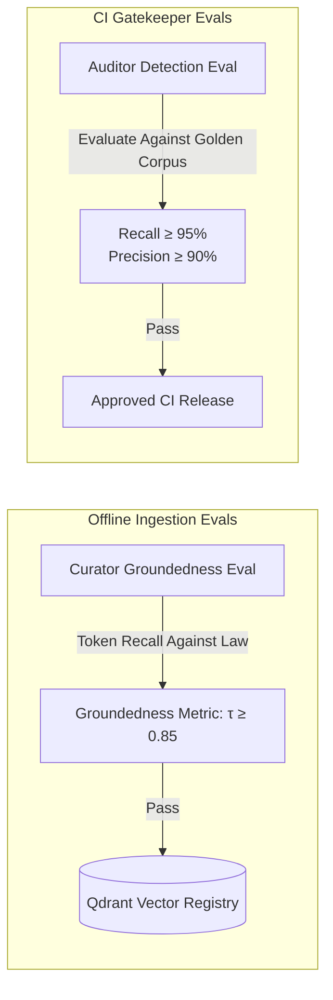
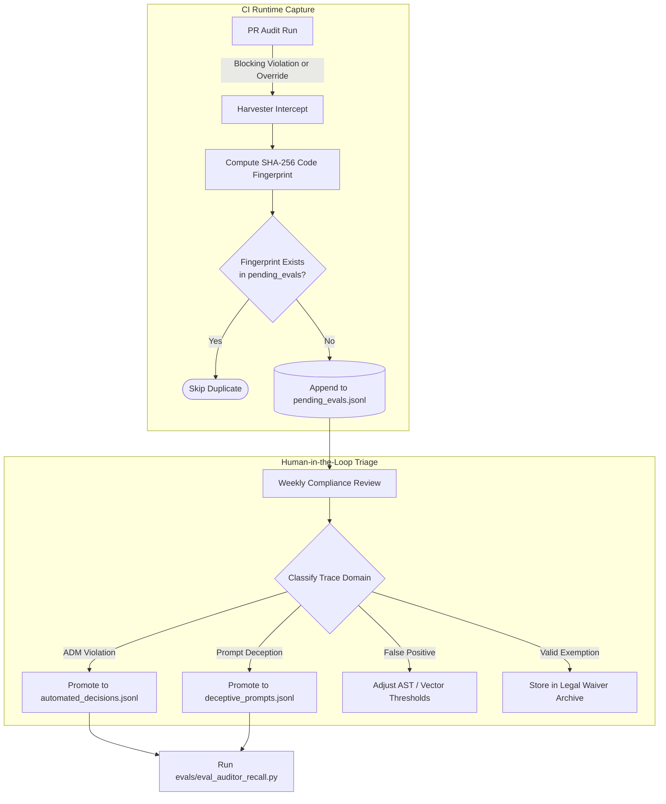

# Evaluation Framework & Active Learning Telemetry

This document details the benchmarking architecture, quantitative metrics, and active learning harvesting lifecycle used in `AISafetyCompliance`. It defines how statutory compliance checks are continuously evaluated and hardened against regression.

---

## 1. Evaluation Architecture: Tests vs. Evals

The repository strictly decouples **deterministic software unit tests** from **probabilistic AI/statutory evaluation suites**:

```
ai-safety/
├── tests/                           # Deterministic Software Unit Tests
│   └── test_legislation_tool.py     # Network timeouts, XML parsing, cache roundtrips
│
└── evals/                          # Model & Compliance Evaluation Suites
    ├── eval_curator_groundedness.py # Curator quotation extraction & hallucination checks
    ├── eval_auditor_recall.py       # Auditor statutory detection recall & precision
    └── benchmarks/                     # Domain-Specific Evaluation Datasets & Buffer
        ├── automated_decisions.jsonl   # UK DUAA s. 80 / Art 22C ADM benchmark suite
        ├── deceptive_prompts.jsonl     # EU AI Act Art. 50 synthetic disclosure benchmark suite
        └── pending_evals.jsonl         # Active learning harvest buffer from CI runs
```

| Dimension | `tests/` (Software Unit Tests) | `evals/` (Compliance Evaluation Suites) |
| :--- | :--- | :--- |
| **Target Functionality** | Tool plumbing, HTTP retry logic, cache hits/misses, CLI flag parsing. | Ground-truth quotation groundedness, statutory evasion recall, false-positive rates. |
| **Pass/Fail Criteria** | Boolean assertions (`assert response.status_code == 200`). | Statistical thresholding (e.g. Groundedness $\ge 0.85$, Violation Recall $\ge 95\%$). |
| **Execution Trigger** | Every local pre-commit and basic CI push. | Release gatekeepers, scheduled nightly runs, and PR compliance pipelines. |

---

## 2. Evaluation Suites & Quantitative Metrics



### 2.1 Curator Groundedness Evaluation (`evals/eval_curator_groundedness.py`)

* **Objective:** Ensure the Curator Agent does not invent statutory clauses, hallucinate legal powers, or misquote primary legislation during distillation.
* **Metric (Quotation Groundedness):**
  Calculates the percentage of unique words in the extracted quote that appear verbatim in the source statutory text.
* **Pass Threshold (>= 85%):**
  At least 85% of the extracted quote's words must exist in the raw statute. Any quote falling below this threshold is rejected as an LLM hallucination before entering the vector store.
* **Benchmark Corpus:** Evaluated against `evals/benchmarks/golden_statutes.json` containing verified provisions from UK DUAA 2025 s. 80 and EU AI Act Regulation 2024/1689.

### 2.2 Auditor Statutory Recall Evaluation (`evals/eval_auditor_recall.py`)

* **Target Metrics:**
  * **Violation Recall (>= 95%):** Ensures no illegal automated decisions or deceptive personas slip past CI.
  * **Violation Precision (>= 90%):** Minimizes false-alarm interruptions for developers.
* **Benchmark Suites:** Evaluated against domain-separated JSONL fixtures:
  * `evals/benchmarks/automated_decisions.jsonl`: Curated variations of credit scoring, candidate screening, and autonomous decision flows without human-in-the-loop review routes.
  * `evals/benchmarks/deceptive_prompts.jsonl`: Curated system prompts directing agents to conceal synthetic identity or impersonate human staff.

---

## 3. The Active Learning Harvesting Pipeline

Real-world code variations and adversarial prompts continuously challenge static rules. The **Trace Harvester** (`src/tools/harvester.py`) turns CI execution failures into an automated training and evaluation flywheel.

