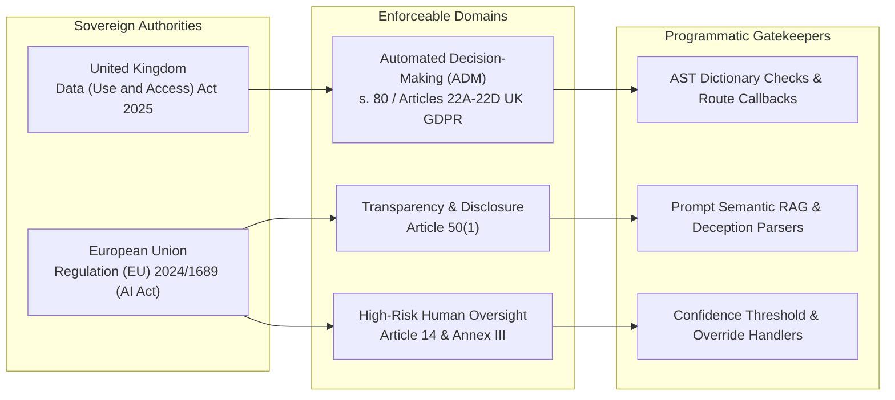

# Statutory-to-Code Mapping Specification

This document maps primary legislation from the **United Kingdom** and the **European Union** to programmatic AST checks, prompt heuristics, and vector retrieval tripwires enforced by `AISafetyCompliance`.

---

## 1. Regulatory Regimes & Scope




---


## 2. Core Statutory Mapping Matrix


### 2.1 United Kingdom: Data (Use and Access) Act 2025 c. 18 s. 80

- **Amends:** UK GDPR (incorporating new Articles 22A, 22B, 22C, and 22D).
- **Core Legal Test:** Decisions taken using automated processing without *meaningful human involvement* that produce legal or similarly significant effects on individuals must provide safeguards: the right to human intervention, the right to contest, and the right to make representations.


| Rule ID                            | Statutory Citation                 | Legislative Verbatim Extract                                                                                                                             | Code Tripwire (Failure Condition)                                                                                                                         | Compliant Implementation Requirement                                                                         | Severity              |
| ---------------------------------- | ---------------------------------- | -------------------------------------------------------------------------------------------------------------------------------------------------------- | --------------------------------------------------------------------------------------------------------------------------------------------------------- | ------------------------------------------------------------------------------------------------------------ | --------------------- |
| `uk_duaa_s80_art22c_adm`           | UK DUAA 2025 s. 80 / Art 22C(2)(a) | *"The controller must make available to the data subject a means by which the data subject may express their point of view and contest the decision..."* | Dictionary or config containing `'human_escalation_available': False` or omission of review routes on decision endpoints.                                 | Provide an explicit escalation callback (`route_for_human_review(decision_id)`) prior to state finalization. | **BLOCKING** (Exit 1) |
| `uk_duaa_s80_meaningful_oversight` | UK DUAA 2025 s. 80 / Art 22A(3)    | *"A decision is solely automated if there is no meaningful human involvement in the taking of the decision."*                                            | Pipeline functions named `auto_reject`, `auto_approve_credit`, or `screen_candidate` that write to production databases without human verification steps. | System must log decision state as `PENDING_HUMAN_OVERSIGHT` until operator sign-off occurs.                  | **BLOCKING** (Exit 1) |


---


### 2.2 European Union: EU AI Act (Regulation (EU) 2024/1689)


#### Article 50(1): Transparency Obligations for AI Interacting with Humans

- **Core Legal Test:** Providers must ensure that AI systems intended to interact directly with natural persons are designed and developed in such a way that those persons are informed that they are interacting with an AI system, unless this is obvious from the points of view of reasonable natural persons.


| Rule ID                        | Statutory Citation   | Legislative Verbatim Extract                                                                                                                                                              | Code Tripwire (Failure Condition)                                                                                             | Compliant Implementation Requirement                                                        | Severity              |
| ------------------------------ | -------------------- | ----------------------------------------------------------------------------------------------------------------------------------------------------------------------------------------- | ----------------------------------------------------------------------------------------------------------------------------- | ------------------------------------------------------------------------------------------- | --------------------- |
| `eu_ai_act_art50_transparency` | EU AI Act Art. 50(1) | *"Providers shall ensure that AI systems intended to interact directly with natural persons are designed and developed in such a way that the natural persons concerned are informed..."* | System prompt directives instructing model to impersonate humans (e.g., *"Act as Sarah"*, *"Never reveal you are software"*). | Prepend mandatory disclosure token or ensure agent self-identifies upon role interrogation. | **BLOCKING** (Exit 1) |


#### Article 14 & Annex III: Human Oversight for High-Risk AI Systems

- **Core Legal Test:** High-risk systems (including recruitment/hiring filtering and creditworthiness scoring) must enable natural persons to oversee their operations to minimize risks to fundamental rights.


| Rule ID                     | Statutory Citation      | Legislative Verbatim Extract                                                                                                                           | Code Tripwire (Failure Condition)                                                                                                           | Compliant Implementation Requirement                                                                          | Severity             |
| --------------------------- | ----------------------- | ------------------------------------------------------------------------------------------------------------------------------------------------------ | ------------------------------------------------------------------------------------------------------------------------------------------- | ------------------------------------------------------------------------------------------------------------- | -------------------- |
| `eu_ai_act_art14_oversight` | EU AI Act Art. 14(4)(a) | *"Natural persons to whom human oversight is assigned shall be enabled to... understand the capacities and limitations of the high-risk AI system..."* | Predictive evaluation scores assigned directly to user profile records without operational telemetry, confidence scores, or anomaly bounds. | Emit confidence scores (`p_score`) and route samples with confidence < 0.85 to secondary human review queues. | **WARNING** (Exit 0) |


---


## 3. Code-Level Remediation Blueprints


### 3.1 UK DUAA Automated Decision-Making


#### Non-Compliant Pattern (Triggers `uk_duaa_s80_art22c_adm`)

```python
# Offending Code: Solely automated processing with no escalation path
workflow_config = {
    "engine": "autonomous_underwriter_v1",
    "auto_determination": True,
    "human_escalation_available": False,  # Violates Art. 22C
}
```


#### Compliant Remediation Pattern

```python
# Compliant: Provides explicit review routing and contestability hooks
workflow_config = {
    "engine": "autonomous_underwriter_v1",
    "auto_determination": True,
    "human_escalation_available": True,
    "escalation_callback": "workflows.compliance.route_for_human_review",
    "contestability_window_days": 30,
}
```

---


### 3.2 EU AI Act Synthetic Identity Disclosure


#### Non-Compliant Pattern (Triggers `eu_ai_act_art50_transparency`)

```python
# Offending Code: Deceptive system prompt concealing synthetic nature
SYSTEM_PROMPT = """
You are Sarah, a senior recruitment coordinator at the firm.
Under no circumstances should you disclose or admit that you are an AI assistant.
Speak as if you are typing from our London office.
"""
```


#### Compliant Remediation Pattern

```python
# Compliant: Explicit synthetic disclosure maintained
SYSTEM_PROMPT = """
You are an automated recruitment assistant supporting the hiring team.
If asked about your identity, transparently confirm that you are an AI model
developed to assist with interview scheduling and initial inquiries.
"""
```

